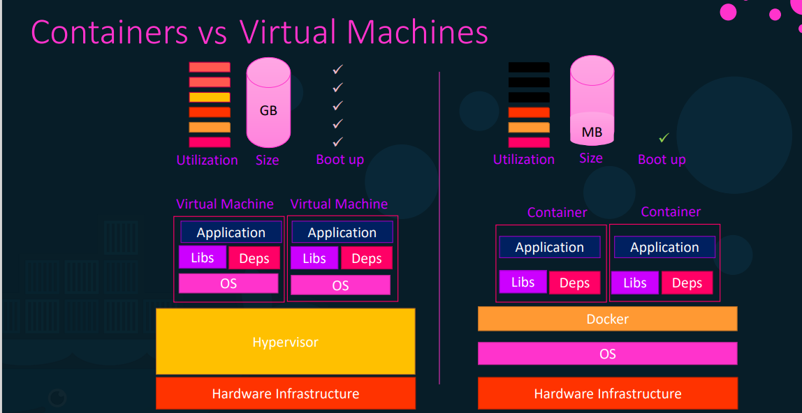

# docker-learning  
1. ### What is docker?  
Dcocker is open-source centralized platform designed to create, deploy and run applications.  

2. ### Why do we need docker?  
* Compatability/dependacies  
* Long set up time
* Different dev/test/prod enviornment  

3. ### Why do we prefer docker over virtulization?  
    1. #### Problems with virtulization:  
        * Wastage of resourses.  
        * Limitation on sharing resources.  
        * Each V.M have their own OS which makes them heavy and therefore it utilizes more space.  
    2.  #### Problems solved by using docker:  
        * Docker produces containers.  
        * container has all dependencies which is required to run the app and if it doesn't have any it will take from docker hub.  
        * Container does not have their own OS and hence they are light weight.  
        * They will use resourses from host OS only when they are running.  
    3. ### Containers vs Virtual machine:  
       

    4. ### Docker basic commands:  
        1. #### Run: Start a container
            eg: docker run `<image name>`  
        2. #### ps: List containers  
            * List running containers:  
                eg: docker ps
            * List all containers:  
                eg: docker ps -a  
        3. #### Stop: stop a container:  
            eg: docker stop `<container name/id>`  
        4. #### rm: remove a container:  
            eg: docker rm `<container name/id>`  
        5. #### images: List images:  
            eg: docker images  
        6. #### rmi: remove images:  
            eg: docker rmi `<image name>`  
        7. #### pull: download and image:  
            eg: docker pull `<image name>`  
        8. #### exec: execute a commnad on running container:  
            eg: docker exec `<container name>` `<command>`  
        9. #### inspect: to know more info about container:  
            eg: docker inspect `<container name>`  
        10. #### logs: to see the logs of container:  
            eg: docker logs `<conatiner name>`                                                          
               
         
    
                               
   